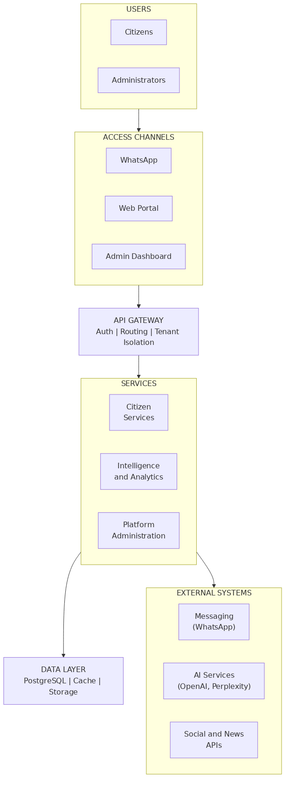

# Munici Smart Connect

Conceptual platform for digital transformation in municipal management, focused on connecting citizens, services, and public administration through a unified digital ecosystem.

---

## Context

Municipalities typically operate with fragmented systems across departments such as finance, health, education, and citizen services. This fragmentation leads to inefficiencies, poor user experience, and limited data integration.

This project explores how to design a unified platform to centralize services, improve operational efficiency, and enhance citizen engagement.

---

## Objective

Design a scalable and modular architecture capable of:

* Centralizing citizen services into a single platform
* Enabling integration across multiple municipal systems
* Supporting high volumes of requests and concurrent users
* Providing a foundation for data-driven decision-making

---

## Architecture Overview

The system is designed following a modular and scalable approach, allowing independent evolution of core domains.

## Architecture Diagram

### Key Components

* **Frontend Layer**
  User-facing interface designed for accessibility and usability

* **API Layer**
  Central gateway responsible for orchestrating services and managing requests

* **Service Layer**
  Domain-oriented services (e.g., citizen services, requests, notifications)

* **Data Layer**
  Structured data storage with support for scalability and integration

---

## Design Principles

* **Modularity**: separation of concerns across domains
* **Scalability**: architecture designed to support growth in users and services
* **Interoperability**: ability to integrate with legacy systems and external APIs
* **Resilience**: fault tolerance and system reliability
* **Security & Compliance**: alignment with data protection and governance requirements

---

## Technical Decisions

This project prioritizes clarity of structure and architectural thinking over implementation complexity.

Key considerations:

* API-centric communication between components
* Decoupled services to enable independent scaling
* Clear separation between presentation, business logic, and data layers
* Flexibility to evolve from a modular monolith to microservices if needed

---

## Trade-offs

* Simplicity vs. scalability: initial structure favors simplicity while enabling future scaling
* Speed vs. robustness: designed as a conceptual foundation rather than production-ready system
* Abstraction vs. implementation: emphasis on architecture over deep technical optimization

---

## Possible Evolution

* Introduction of microservices for high-demand domains
* Event-driven architecture for asynchronous processing
* Integration with authentication providers (e.g., gov identity systems)
* Advanced analytics and data pipelines

---

## Purpose of this Repository

This repository is not intended to represent a production-ready system, but rather:

* A demonstration of architectural thinking
* An exploration of system design decisions
* A reference for how to structure scalable digital platforms

---
